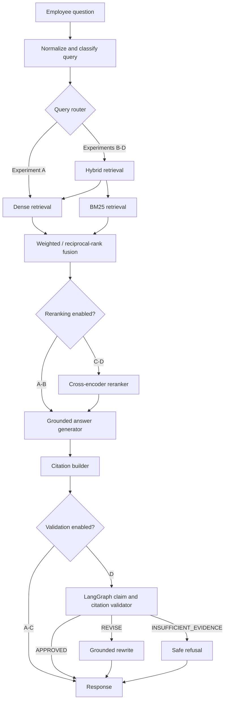
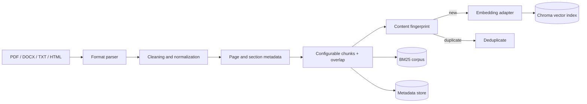
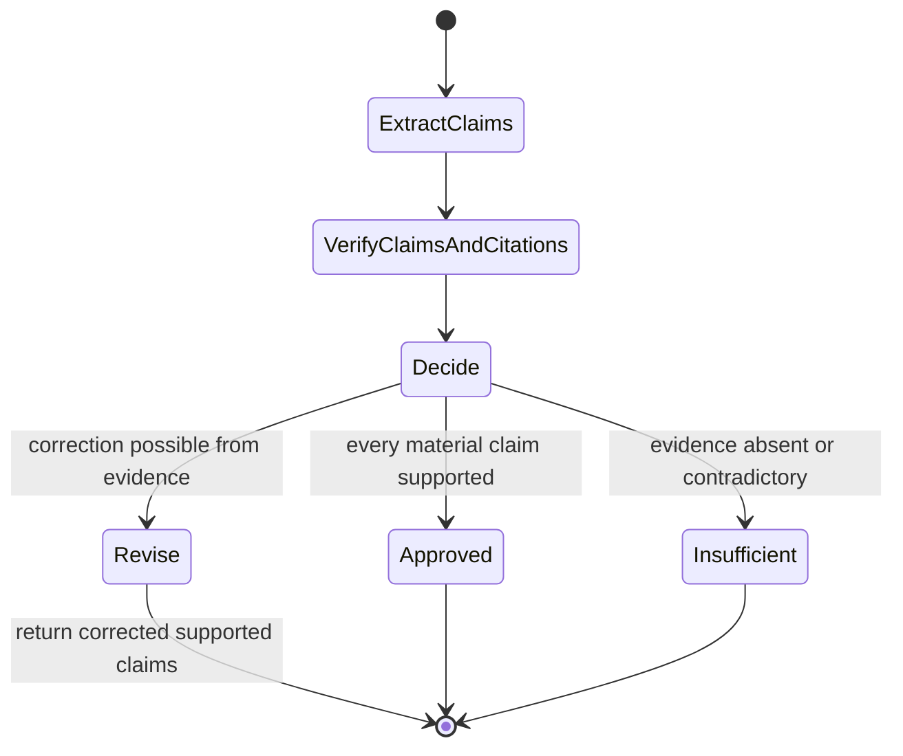

# System architecture

Enterprise Knowledge Copilot is organized as a modular monolith for local development and as independently deployable API, web, and experiment-tracking services in Docker. Retrieval, generation, and validation are exposed behind Python interfaces so individual providers can be replaced without changing the HTTP contract.

## Online query path

The API returns both a human-readable answer and machine-readable provenance. Retrieval candidates retain their original chunk metadata throughout fusion and reranking; citations are never reconstructed from model memory.

## Ingestion path

Documents receive stable identifiers based on content. Chunks carry `document_id`, `document_name`, `page_number`, `section`, `chunk_id`, text, and arbitrary metadata. A separate fingerprint prevents duplicate source passages from being inserted during repeated indexing.

## Retrieval experiments

| Version | Dense | BM25 | Fusion | Cross-encoder | Citations | Validator |
|---|---:|---:|---|---:|---:|---:|
| A — Dense RAG | Yes | No | — | No | Optional response metadata | No |
| B — Hybrid RAG | Yes | Yes | Weighted merge | No | Optional response metadata | No |
| C — Hybrid + reranker | Yes | Yes | Reciprocal-rank fusion | Yes | No | No |
| D — Hybrid + validator | Yes | Yes | Reciprocal-rank fusion | Yes | Yes | LangGraph |

The experiment name is part of each query and metric record. This prevents comparisons from silently using different parameters.

## Validation state machine

The LangGraph state contains the question, proposed answer, retrieved passages, citations, claim assessments, and terminal verdict.

The deterministic validator remains available when no LLM key is configured. It evaluates sentence-level lexical support, cited chunk identity, citation coverage, contradictions detectable from expected negations/numbers, and evidence thresholds. A `REVISE` verdict returns only supported claims; the caller rebuilds citations over that corrected answer.

## Storage boundaries

- Chroma stores embeddings and chunk metadata in a persistent volume.
- The metadata repository stores source-document state, feedback, and query audit records.
- The BM25 index is reconstructed from persisted chunks at startup or indexing time.
- MLflow stores versioned experiment parameters, metrics, and report artifacts.
- Raw uploads are isolated from public web assets and accepted only through the API.

## Production hardening notes

The reference implementation is deliberately provider-neutral. Before handling confidential documents, deploy behind enterprise identity, use per-tenant collections and row-level authorization, encrypt storage and backups, scan uploads for malware, redact sensitive logs, set provider data-retention controls, and place asynchronous ingestion on a job queue. The included deployment is a strong local/reference baseline, not a substitute for an organization's security review.
